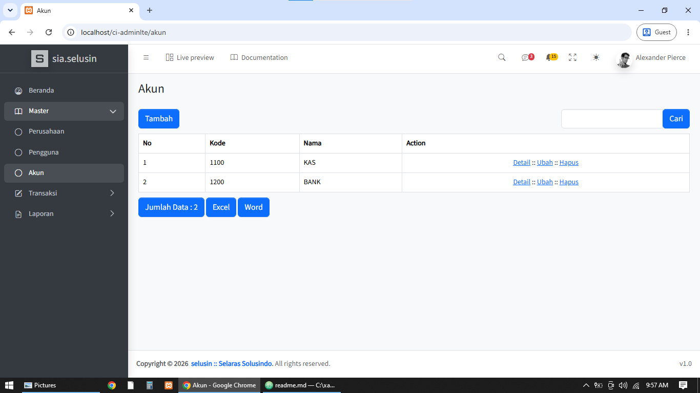

# CI AdminLTE

## Deskripsi

Aplikasi CodeIgniter 3 dengan HMVC, AdminLTE v4.0.0 (Bootstrap 5), dan Harviacode (CRUD Generator).

## Persyaratan

- PHP 5.6 - 7.4
- MySQL/MariaDB
- Apache atau Nginx

## Instalasi

```bash
git clone https://github.com/devselusin4791-cyber/ci-adminlte.git
cd ci-adminlte
```

## Konfigurasi

- Edit `application/config/database.php`

## Harviacode

- Untuk mengakses fitur Harviacode:

```bash
http://localhost/ci-adminlte/harviacode
```

## Modul hasil Harviacode
- Master - Akun

## Screenshot



## Lisensi

MIT

## ❤️ Dukung Pengembangan Proyek

Proyek ini dikembangkan dan dipelihara secara mandiri agar dapat digunakan secara bebas oleh siapa saja.

Apabila proyek ini bermanfaat bagi Anda atau membantu mempercepat proses pengembangan aplikasi, Anda dapat memberikan dukungan melalui [Saweria](https://saweria.co/devselusin4791) atau [Trakteer](https://trakteer.id/dev_selusin). Setiap dukungan akan digunakan untuk pengembangan fitur baru, perbaikan bug, peningkatan dokumentasi, dan pemeliharaan proyek agar tetap aktif.

- ☕ **Saweria:** https://saweria.co/selusin
- ☕ **Trakteer:** https://trakteer.id/globalselusin

Terima kasih atas dukungan dan kepercayaan Anda. Semoga proyek ini dapat terus memberikan manfaat bagi banyak orang. 🙏
